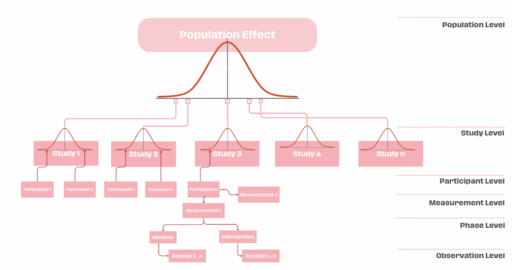
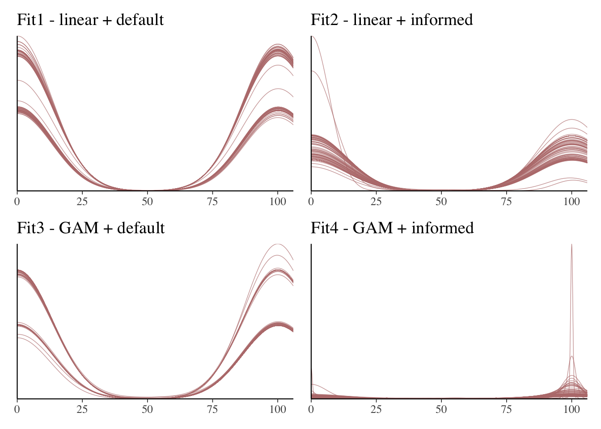
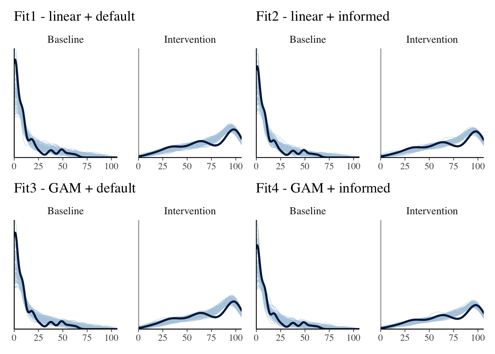

## Synthesis plan

We will conduct an individual participant data meta-analysis, by modelling a Bayesian, beta-binomial hierarchical regression. 
Model coefficients will be presented on the log-odds scale. The intervention effect is represented by two parameters: the level shift between phases, and the change in slope between baseline and intervention. The model additionally estimates baseline level and trend. These parameters reflect the level and trend dimensions of SCED analysis recommended by WWC guidelines. For interpretation, marginal effects of the level and trend will be reported, transformed into probabilities of word recognition success. The analyses will be performed in R (R Core Team, 2023; R version 4.3.1), using the $\texttt{brms}$ (@burknerBrmsPackageBayesian2017) package, an R wrapper for the probabilistic programming language Stan (Stan Development Team, 2024), and $\texttt{marginaleffects}$ (@vinc). \
We will conduct separate analyses for each category of reading intervention (phonological awareness, fluency, and phonics), as we do not consider them conceptually homogeneous enough to aggregate in one model. Likewise, we will group the analyses based on designs that can be synthesized in the same model. With four groups based on design, and three interventions (phonological awareness, fluency, and phonics), we anticipate at most 12 main meta-analytic models, given that we find at least two eligible studies for each category. Table 2 illustrates possible combinations and designs we plan to synthesise together. \

**Table 2**  
*Study design and intervention matrix*

| Major Design Groups                  | Subdesigns                                                                 | Intervention Categories                |
|---------------------------------------|----------------------------------------------------------------------------|----------------------------------------|
| 1. AB and Multiple Baseline Designs   | AB Design \ Multiple Baseline across participants \ Multiple Baseline across settings/situations \ Multiple Baseline across time \ Multiple Probe Design | A) Phonological Awareness \ B) Fluency \ C) Phonics |
| 2. Changing Criterion Designs         | Changing Criterion (CC) Design                                              | A) Phonological Awareness \ B) Fluency \ C) Phonics |
| 3. Multiple-Treatment Designs         | Multi-element Design \ Alternating-Treatment Design (ATD) \ Adapted Alternating-Treatment Design \ Simultaneous-Treatment Design | A) Phonological Awareness \ B) Fluency \ C) Phonics |
| 4. Reversal (ABAB) Designs             | ABAB (Reversal/Withdrawal) Design                                           | A) Phonological Awareness \ B) Fluency \ C) Phonics |
| Combination Designs / Other                           | NA                                               | Not applicable                         |


In the first group, we will aggregate multiple baseline designs (and their variants), and multiple probe designs. We consider these designs similar in logic, and as long as the intervention and outcome are kept homogeneous, we can model the variations in measurement and intervention setup across stages as random variation. \

In the second group, we will synthesise changing-criterion (CC) designs. We will model CC designs according to the same formula as multiple baseline/AB designs, but separately from those designs. This aligns with the suggested analytical approach by  @shadishAnalyzingDataSingleCase2013, which suggested an analytical approach where one regards all criterion phases as the intervention phase and compares to the baseline (ignoring the stabilizing phases between criterion phases). Although modelling the CC design this way would functionally make it comparable to multiple baseline/AB design setup, the staggered nature of CC designs might artificially flatten the slope compared to AB or multiple baseline designs, where the mastery of the final desired outcome may come immediately, or at least early in the intervention phase. \

The third group will consist of comparative study designs (Ledford & Gast, 2018). For studies using ATD, we will follow a structured extraction workflow: First, we will verify that a baseline phase is present, either as a pre-intervention phase or a comparison phase without treatment. If no baseline is available, the study will be excluded from extraction. If a baseline is present, we will assess the treatment phases. If both treatments do not belong to the same intervention category, the study will not be included in the analysis. Studies without a baseline/no treatment condition or comparing different intervention categories would not answer our research question which does not focus on the relative effectiveness of interventions. The baseline data will be explicitly modeled as “Baseline,” and the superior treatment data will be modeled as “Intervention,” extracting all available points. In all cases, data extraction will be done sequentially to maintain the chronological order of sessions in the dataset.  These analyses follow modelling alternatives suggested by @manolovMetaanalysisSinglecaseExperimental2023a and @moeyaertEstimatingInterventionEffects2015a, based on the decision trees driven by the research question.\

If we happen to find alternating/reversal phase designs (i.e., ABAB designs), we will aggregate them in the fourth group, although due to the nature of the intervention (learning effects), we do not expect to find studies with these designs. \

We will not model interventions categorized as other as we expect that category to be overly heterogeneous. 

We will model the baseline and intervention phase separately in our main meta-analysis model, with interaction with time (session). We will also not model autocorrelation. Although the literature suggests the existence of moderate autocorrelation, particularly in multiple-baseline designs (@shadishCharacteristicsSinglecaseDesigns2011), we could model it as an exploratory analysis only due to unknown estimates. 

### Model
Level one of the multilevel model describes the relationship between the outcome - word or non-word reading, and the predictor - reading intervention. Informed by previous reviews with similar interest, we assume majority of the studies will employ non-standardized word-reading tests, with counts and percentages as measures, and fixed word lists. We assume the existence of autocorrelation (but will not model it explicitly) and knowledge transfer, therefore, we cannot assume the trials are independent. We will use a beta-binomial outcome distribution to model correct responses out of total trials (@gelmanBayesianDataAnalysis2020). For studies reporting proportions, counts will be reconstructed if the number of trials was reported. If the denominator is not available, we will contact study authors. Studies will be excluded if this information remains unavailable. Figure 1 illustrates the multiple levels in a meta-analysis.

To calculate the effect for our meta-analysis, we need to account for participant and study clusters. There are two ways to approach the raw data - calculate average effects per study and do a meta-analysis of those effects (which is the common way of conducting a meta-analysis when you don't have raw data) or build a model that directly calculates the population (average) effect from the raw data. We will do the latter, the one stage approach.

**Figure 1**


Thus, our starting model is as follows:

$$
Y_{ijk} \sim BetaBin(N_{ijk}, \mu_{ijk}, \theta)
$$ {#eq-betabin}

Beta-binomial distribution can be explained as a binomial distribution that has its probability parameter informed by the beta distribution of probabilities. $Y_{ijk}$ in @eq-betabin represents the number of correct responses for each individual (j) within a study (k) at a certain time point i = 1, ..., n. $BetaBin$ indicates the observations are drawn from a beta-binomial distribution which has the $N_{ijk}$ parameter for the number of trials, $\mu_{ijk}$ for the average probability (Some authors denote it as pbar; @mcelreathStatisticalRethinkingBayesian2020) of the beta distribution and $\theta$ as the dispersion (precision) parameter of the beta distribution (some authors might note it as $\phi$; @burknerBrmsPackageBayesian2017). $\theta$ represents the within-individual residual variance, which can be compared to observation-level random effects assigned to binomial models to account for varying observations across sessions. 


$$
\operatorname{logit}(\mu_{ijk}) = \beta_{0jk} + \beta_{1jk} \operatorname{session}_{ijk} + \beta_{2jk}  \operatorname{ID}_{ijk} + \beta_{3jk} \operatorname{ID}_{ijk}*\operatorname{session}_{ijk} 
$$ {#eq-one}


In @eq-one $\beta_{0jk}$ represents the baseline log-odds at the first baseline session. $\beta_{1jk} \operatorname{session}_{ijk}$ is the baseline slope on log-odds scale, i.e., the change in outcome during the baseline phase at the following sessions. $\beta_{2jk} \operatorname{ID}_{ijk}$ represents the log-odds level change, i.e., the difference between the predicted outcome at the first baseline session and the predicted outcome when the intervention is introduced (first intervention session). Finally, the change in log-odds slope predicted by the interaction between the session and phase is estimated by $\beta_{3jk} \operatorname{ID}_{ijk}*\operatorname{session}_{ijk}$, with the intervention trend presented by $\beta_{1jk}$ + $\beta_{3jk}$. 

We will introduce the session parameter centered by phase and case, which means that both phases (baseline and intervention) will begin with session 0 within each case. This indexing will allow us to interpret the level-shift coefficient (i.e., IDIntervention coefficient) as the difference between the phases at session 0. Furthermore, we will be able to compare the change in slope between baseline and intervention via the interaction term coefficient (i.e., session:IDIntervention).

The model estimates baseline level and trend, along with changes in level and slope following the intervention. Random effects for these four components are estimated at both the participant and study level, allowing learning trajectories to vary across individuals within studies (jk) and across studies (k). 

$$ 
{participant\ level}     
 \begin{align}
                 \left\{
                 \begin{matrix} \beta_{0jk} &=& \alpha_{00k} + \psi_{0jk} 
                 \\\beta_{1jk} &=& \alpha_{10k} + \psi_{1jk}        
                 \\\beta_{2jk} &=& \alpha_{20k} + \psi_{2jk} 
                 \\\beta_{3jk} &=& \alpha_{30k} + \psi_{3jk} \end{matrix}
                 \right.
                 \end{align}
$$ {#eq-two}


$$ 
\begin{align}
    \left.
        \begin{aligned}
            & \psi_{0jk} \\
            & \psi_{1jk} \\
            & \psi_{2jk} \\
            & \psi_{3jk} \\
        \end{aligned}
    \right\} \quad & \sim N \begin{bmatrix}
                            0 \\
                            0 \\
                            0 \\
                            0
                            \end{bmatrix} , \begin{bmatrix}
 \omega_{0}^2 & \omega_{01} & \omega_{02} & \omega_{03} \\
 \omega_{01} & \omega_{1}^2 & \omega_{12} & \omega_{13} \\
 \omega_{02} & \omega_{12} & \omega_{2}^2 & \omega_{23} \\
 \omega_{03} & \omega_{13} & \omega_{23} & \omega_{3}^2
\end{bmatrix}
    \\
\end{align}
$$ {#eq-three}

@eq-two defines participant level coefficient as follows: $\beta_{0jk}$ is estimated from a distribution with an average study baseline value $\alpha_{00k}$, and its error term $\psi_{0jk}$. $\beta_{1jk}$ is estimated from a distribution with average study baseline slope $\alpha_{10k}$, and the error term $\psi_{1jk}$. $\beta_{2jk}$ is estimated from a distribution with an average study-level change from baseline to intervention word recognition success $\alpha_{20k}$, and the error term $\psi_{2jk}$. Finally, $\beta_{3jk}$ is estimated from a distribution with an average study-level change in slope for the word recognition success $\alpha_{30k}$, and the error term $\psi_{3jk}$.

These individual-level errors $\psi_{0jk}$, $\psi_{1jk}$, $\psi_{2jk}$, and $\psi_{3jk}$ come from a multivariate normal distribution with mean zero and variance-covariance matrix (@eq-three) and represent the variation in values between participants (j) in a study (k), i.e., random effects on participant level. $\omega_{0}^2$, $\omega_{1}^2$, $\omega_{2}^2$, and $\omega_{3}^2$ in the matrix are the variance of individual-level errors, and $\omega_{01,02,03,12,13,23}$ are covariances between individual-level error terms.


$$ 
  \begin{align}
  {study\ level} 
          \left\{
          \begin{matrix} \alpha_{00k} &=& \eta_{000} + \upsilon_{00k} 
        \\\alpha_{10k} &=& \eta_{100} + \upsilon_{10k} 
        \\\alpha_{20k} &=& \eta_{200} + \upsilon_{20k} 
        \\\alpha_{30k} &=& \eta_{300} + \upsilon_{30k}
        \end{matrix}
          \right.
          \end{align}
$$ {#eq-four}


$$ 
\begin{align}
    \left.
        \begin{aligned}
            &  \upsilon_{00k} \\
            &  \upsilon_{10k}  \\
            &  \upsilon_{20k}  \\
            &  \upsilon_{30k}  \\
        \end{aligned}
    \right\} \quad & \sim N \begin{bmatrix}
                            0 \\
                            0 \\
                            0 \\
                            0
                            \end{bmatrix} , \begin{bmatrix}
 \Upsilon_{0}^2 & \Upsilon_{01} &  \Upsilon_{02} &  \Upsilon_{03} \\
 \Upsilon_{01} &  \Upsilon_{1}^2 & \Upsilon_{12} &  \Upsilon_{13} \\
 \Upsilon_{02} &  \Upsilon_{12} &  \Upsilon_{2}^2 & \Upsilon_{23} \\
 \Upsilon_{03} &  \Upsilon_{13} &  \Upsilon_{23} &  \Upsilon_{3}^2
\end{bmatrix}
    \\
\end{align}
$$ {#eq-five}

@eq-four defines study level coefficient as follows: $\alpha_{00k}$ is estimated from a distribution with an average population baseline value $\eta_{000}$, and its error term $\upsilon_{00k}$. $\alpha_{10k}$ is estimated from a distribution with average population baseline slope $\eta_{100}$, and the error term $\upsilon_{10k}$. $\alpha_{20k}$ is estimated from a distribution with an average population-level change from baseline to intervention word recognition success $\eta_{200}$, and the error term $\upsilon_{20k}$. Finally, $\alpha_{30k}$ is estimated from a distribution with an average population-level change in slope for the word recognition success $\eta_{300}$, and the error term $\upsilon_{30k}$.

Study-level errors $\upsilon_{00k}$, $\upsilon_{10k}$, $\upsilon_{20k}$, and $\upsilon_{30k}$ are also multivariate normally distributed with a mean of zero and variance-covariance matrix (@eq-five), and represent the variation in values between studies (k), i.e., random effects on study level. $\Upsilon_{0}^2$, $\Upsilon_{1}^2$, $\Upsilon_{2}^2$, and $\Upsilon_{3}^2$ in the matrix are the variance of study-level errors, and $\Upsilon_{01,02,03,12,13,23}$ denote covariances of the study-level error terms.

We set initial priors for the fixed effects for the baseline and intervention intercept and slopes in @eq-six and @eq-seven as weakly informative priors. At this time, there is no strong empirical information in the literature to define stronger priors beforehand, with the most relevant information provided by Grekov et al. (2025). However, since they modeled outcomes using a different likelihood (i.e., negative binomial), we cannot rely on their reported priors. In Stage 2, we will conduct prior predictive checks of the pre-defined weakly informative priors using the observed design structure of the assembled dataset (e.g., number of sessions, phase lengths, and trial denominators) while withholding the observed outcomes. Priors will be refined in case the prior predictive check identifies implausible outcome trajectories or distributions.

$$
\eta_{000} \sim \operatorname{Student}(3, 0, 2.5)
$$ {#eq-six} 

$$
\eta_{100}, \eta_{200}, \eta_{300} \sim \operatorname{Student}(3, 0, 2.5)
$$ {#eq-seven} 

We draw the standard deviations of the individual- and study-level random effects from the half-student-t distributions, instead of normal, as it allows the possibility of extreme (tail) values. Student-t distribution accommodates the uncertainty of these values. By defining it as "half", we constrain the distribution only to positive values for the standard deviations. @eq-nine and @eq-ten describe the priors assigned to standard deviations at case and study levels.\

$$
\Upsilon_{0}, \Upsilon_{1}, \Upsilon_{2}, \Upsilon_{3} \sim \operatorname{Half-Student}(3, 0, 2.5)
$$ {#eq-nine}  

$$
\omega_{0}, \omega_{1}, \omega_{2}, \omega_{3}  \sim \operatorname{Half-Student}(3, 0, 2.5)
$$ {#eq-ten} 

LKJ, the Lewandowski-Kurowicka-Joe distribution, is a probability distribution over positive-definite symmetric matrices with unit diagonals, i.e., correlation matrices (@gelmanBayesianDataAnalysis2020). We use this distribution as a prior for the correlation matrix of effects in the model and set it as $LKJcorr(2)$ of 2, which makes extreme correlations less likely in the correlation matrix but still allows for correlations between the effects (@mcelreathStatisticalRethinkingBayesian2020) (@eq-eleven).\

$$
\mathbf{R} \sim LKJcorr(2)
$$ {#eq-eleven} 

For the observation-level residual variance (the dispersion parameter of the beta-binomial distribution), we assign a prior drawn from the $\gamma$ distribution with dispersion parameters shape = 1 and scale = 1. 

$$
\begin{align}
\theta = \Phi 
\\\Phi \sim gamma(1,1)
\end{align}
$$ {#eq-twelve}

Given the way that the designs are bounding the possible answers to a small range, and often conduct interventions until 100% success rate is achieved, we can expect ceiling effects, large effects in the intervention phase and larger improvements (slope) for those with lower baseline results. \

### Moderator analysis

We will conduct a moderator analysis based on IQ, as findings by @allorScientificallyBasedReading2014 suggest that lower IQ is linked to lower rates of reading development. \
We will introduce IQ as a continuous predictor in the main model, centered around the group mean. While grand-mean centering might be appropriate given that it is one population of participants, in this case, group-mean centering is preferable due to the likely non-random selection of intellectual disability severity within studies (@kreftEffectDifferentForms1995, @endersCenteringPredictorVariables2007). Specifically, the selection of participants with a particular severity level (e.g., mild intellectual disability) may influence the intervention complexity. If IQ were centered around the grand mean, this study-level selection bias could distort estimates, making group-mean centering a more appropriate choice to account for within-study variability. IQ moderator is introduced at the participant level (Level 2 of the multilevel model).

Breaking this down, we set the initial equation at Level 1 (sessions within participants) from @eq-betabin, and then introduce the group-centered IQ predictor at the participant level nested within studies (Level 2):

$$
\begin{align}
\beta_{0jk} = \alpha_{00k} + \alpha_{01k} IQ^c_{jk} + \psi_{0jk} \\
\beta_{1jk} = \alpha_{10k} + \alpha_{11k} IQ^c_{jk} + \psi_{1jk} \\
\beta_{2jk} = \alpha_{20k} + \alpha_{21k} IQ^c_{jk} + \psi_{2jk} \\
\beta_{3jk} = \alpha_{30k} + \alpha_{31k} IQ^c_{jk} + \psi_{3jk} \\
\end{align}
$$ {#eq-iql2}

@eq-iql2 describes the centered IQ introduced at the participant level as the moderator of baseline ($\alpha_{01k}\operatorname{IQ^c}_{jk}$), the session (baseline trend), phase (level shift), and the session-by-phase (trend) ($\alpha_{11k}\operatorname{IQ^c}_{jk}$, $\alpha_{21k}\operatorname{IQ^c}_{jk}$, $\alpha_{31k}\operatorname{IQ^c}_{jk}$, resp.). $\psi_{0jk}$, $\psi_{1jk}$, $\psi_{2jk}$, $\psi_{3jk}$ represent the individual-level random effects following the same structure as presented in @eq-three.

We will include IQ as a continuous variable rather than using categorical intellectual disability severity, as a continuous measure provides more granular and informative modeling of variation. Additionally, there are potentially two types of missing values:\

Missing at random (MAR) --- where IQ scores are either not reported or not permitted for sharing. \
Missing not at random (MNAR) --- where IQ scores are unavailable because participants could not be reliably tested due to the severity of their disability.

If the data is not missing at random, we will not conduct a moderator analysis. In case of an MAR type missingness, we will impute the values with the $\texttt{mice}$ package (@mice).

## Model building workflow

We have pre-specified possible alternatives for the models, based on assumptions about the outcome data and intervention characteristics. However, as we do not have data at the moment of specifying the models, we propose a workflow to determine which model will be selected as the most fitting model once we obtain the data.

We will graphically inspect the data to estimate the growth curve based on sessions, to determine whether time influences the outcome linearly (@eq-betabin) or non-linearly (@eq-thirteen). @eq-thirteen describes a generalized additive model (GAM) with session assumed to be a non-linear predictor. 

Unlike the linear specification, which allows all four components (baseline level and trend, level shift, and slope change) to vary across studies and cases, a direct non-linear alternative with smooth functions varying at both study and case levels is not feasible within the planned model. With the increased complexity of the models, additional variations would be difficult to reliably estimate and interpret. Therefore, GAMs will be interpreted as flexible nonlinear extensions of the population effects, with between-study and between-case heterogeneity captured through the original linear multilevel structure of the model, rather than through fully varying smooth functions. 

Accordingly, we will specify the generalized additive model as described in @eq-thirteen, where $\beta_{0jk}$ represents the baseline performance, $\beta_{1jk}\operatorname{ID}_{ijk}$ represents the level change between phases, but unlike @eq-one, baseline slope and difference between baseline and intervention slope coefficients are modeled as smooth terms $f_0(session_{ijk})$ and $\operatorname{ID}_{ijk} f_1(session_{ijk})$. Multilevel structure of study- and participant-level random effects is described in @eq-four and @eq-five. \

$$
\operatorname{logit}(\mu_{ijk}) = \beta_{0jk} + \beta_{1jk}\operatorname{ID}_{ijk} + f_0(session_{ijk}) + \operatorname{ID}_{ijk} f_1(session_{ijk})
$$ {#eq-thirteen}

The smoothing terms $f_{0,1}(session_{ijk})$ consist of a sum of $M$ simpler basis function $\operatorname{b_{m}}(\operatorname{session}_{ijk})$ and its corresponding coefficients $\beta_{m}$, as described in @eq-spline (@Pedersen2019HGAM). We will use the default values from the smooths function in $\texttt{brms}$, provided by the $\texttt{mgcv}$ package (@mgcv).

$$
f_{0,1}(\operatorname{session}_{ijk}) = \sum_{m=1}^{M}\beta^{(0,1)}_{m}\operatorname{b_{m}}(\operatorname{session}_{ijk})
$$ {#eq-spline}

Table 3 presents initial alternate priors and functions of the predictors that we will apply to the data and test the model fit. The weakly-informative priors are model-specific, and generic regularizing priors, and the initial benchmarking set will be derived from default priors assigned by $\texttt{brms}$. Prior evaluation will be conducted through a prior predictive check during the analysis in Stage 2. Based on these evaluations, weakly informative priors may be refined as needed. We will compare models using LOO and WAIC to select the best model for each meta-analysis as the main model and provide the results of the other model alternatives as a sensitivity analysis. 

**Table 3** \
*Model Specifications and Priors*

| Model  | Session Specification | Priors | Notes |
|--------|---------------------|--------|-------|
| **1A** | Linear (session)    | Default `brms` priors | Baseline model |
| **1B** | Splined (session)   | Default `brms` priors | Non-linear learning trajectory using splines |
| **2A** | Linear (session)    | - `Student_t(3, 0, 2.5)` for `IDIntervention` <br> - default for `session` slope <br> - `Student_t(3, 0, 2.5)` for intercept <br> - `LKJ(2)` for correlations <br> - `Gamma(1, 1)` for `phi` <br> - `Student_t(3, 0, 2.5)` for all group-level SDs | Weakly informative regularizing priors; to be evaluated with prior predictive checks |
| **2B** | Splined (session)      | - `Student_t(3, 0, 2.5)` for `IDIntervention` <br> - default for spline basis coefficients (e.g., `ssession_1`) <br> - `Student_t(3, 0, 2.5)` for intercept <br> - `LKJ(2)` for correlations <br> - `Gamma(1, 1)` for `phi` <br> - `Student_t(3, 0, 2.5)` for group-level SDs <br> - `Student_t(3, 0, 2.5)` for spline smoothness (`sds`) | Weakly informative regularizing priors for fixed, random, and smoothness terms; to be evaluated with prior predictive checks |

While there is a possibility that none of the models will provide an adequate fit, this appears unlikely based on pilot analyses of similar interventions. If none of the models are satisfactory based on the criteria followed in the workflow, we will report all models in the main analysis and interpret the results with appropriate caution, explicitly discussing the limitations. Additionally, we will perform exploratory analyses to better understand the data. \

### Interpretation
To answer our first research question, we will plot posterior distributions of the average intervention effect (average population effect of level shift) and the interaction effect between session and intervention (average population effect of the trend). Furthermore, we will plot the posterior distributions of the random-effects estimates (SD) to assess heterogeneity of intervention effects between studies and between participants within studies. Results describing the level shift will be expressed as predicted probabilities of correct responding in the baseline and intervention phases. These probabilities are obtained by transforming model estimates from the log-odds scale to the probability scale. Trends will be presented as the estimated change in the probability of correct responding between consecutive sessions.

Along with the estimates, we will plot 90% credible and predictive intervals. Credible intervals provide readers with a range of values within which the parameter is expected to lie with a specified probability (i.e., 90%). Additionally, predictive intervals provide a range of values within which new observed outcomes are expected to fall under the fitted model.

To expand the interpretation of predictive intervals and translate the model estimates to more interpretable results, we will plot and report marginal effects of the level and trend effects, for population effects, and conditional on study and participant variation. Marginal effects will be presented as transformed values of the outcome to explain the results in terms of word-recognition success, expressed in percentages. For the marginal effect of the trend, we will present the estimated baseline and intervention slopes set at session 0. If non-linear models are selected as better fitting, we will plot separate slopes for baseline and intervention phase.

To answer the second research question, marginal effects will be presented as predicted probabilities of correct responding at different levels of group-centered IQ: 10 points below the study mean, at the study mean, and 10 points above the study mean. These values correspond to $IQ^{c}_{jk}$ =−10,0,10, where $IQ^{c}_{jk}$ denotes IQ centered around the mean IQ of study k.

### Initial setup of the models and priors

```{r}
#| label: setup
#| echo: FALSE
library(tidyverse) #for wrangling data
library(brms) # for fitting the bayesian models, v. 2.20.4.
library(mgcv) # for modelling smooths within brms
library(splines)
library(mice) # for imputation of missing values
library(tidybayes) # for wrangling and plotting brms models 
library(bayesplot) # for plotting brms models
library(marginaleffects) #for marginal effects
library(collapse) #needed for me functions to work
library(ggdist) 
library(patchwork)
library(modelr)
library(kableExtra)
library(here) # for relative paths within the project
#library(rstanarm) # shows Stan interface within R
# get code from: https://michael-franke.github.io/Bayesian-Regression/practice-sheets/11a-cheat-sheet.html

```


```{r}
#| label: data
#| code-fold: true
#| code-summary: "Data setup"
# data will be cleaned here for analyses. We will filter out maintenance and generalization phases for the analysis. We will also filter data based on SCED design and run all models for each category of designs. 
data <- read_csv(here("analysis", "mydata.csv")) %>% 
  mutate(success_rate = round(success_rate*100, digits = 0),
         fail_rate = round(abs(fail_rate)*100, digits = 0)) %>% 
  filter(ID != "Maintenance") %>% # remove unnecessary rows that will not be modeled
  # filter (intervention == "multiple baseline") %>%  # filter specific SCED designs to model together
  group_by(study, case, ID) %>%  
  mutate(session = row_number()) %>%  
  ungroup() %>%
  mutate(ID = factor(ID, levels = c("Baseline", "Intervention")))  %>% 
  group_by(study, case) %>% 
  mutate(
  session = pmax(0, session - min(session[ID=="Intervention"]))
)


#### quick version of the code
# prereg code is too long to run, example code visible, real code commented our
run_fast <- TRUE   # set to FALSE for the real analysis later -- cca 10 hours

# Stan / brms settings
n_iter   <- if (run_fast) 1000 else 4000
n_warmup <- if (run_fast) 500  else 2000
n_chains <- if (run_fast) 2    else 4
n_cores  <- min(n_chains, parallel::detectCores())

# draws for tidybayes, marginaleffects, pp_check, etc.
ndraws_small <- if (run_fast) 50 else 1000


# optional: use only a subset of data in fast mode
data_demo <- if (run_fast) {
  data %>%
    group_by(study, case, ID) %>%
    slice_head(n = 5) %>%    # only first few sessions per case
    ungroup()
} else {
  data
}

#data %>% filter(ID == "intervention") %>% ggplot(aes(x = x, y = success_rate, color = case)) +
#  geom_point() +
#  geom_line() +
#  facet_wrap(~study, ncol = len())

```

```{r}
#| label: formula-setup
#| code-fold: true
#| code-summary: "Code for the prior and formula setup for MB/AB"


################################# FORMULA #################################
# regular session formula
model_formula <- bf(success_rate|trials(success_rate + fail_rate) ~ session + ID + session:ID + (1 + session + ID + session:ID | study/case)) 

# nonlinear session formula - run in the real analysis
#model_formula2 <- bf(success_rate|trials(success_rate + fail_rate) ~ + ID + s(session) + s(session, by = ID) + (1 + session + ID + session:ID | study/case)) 

model_formula2 <- bf(success_rate | trials(success_rate + fail_rate) ~ ID + s(session, k = 4) + s(session, by = ID, k = 4) + (1 + session + ID + session:ID | study/case)) #test formula 

################################# PRIORS #################################

## priors for default models (linear and nonlinear)
priors_model_formula <- get_prior(model_formula, data = data_demo, family = beta_binomial())  # linear + default priors
priors_model_formula2 <- get_prior(model_formula2, data = data_demo, family = beta_binomial())  # nonlinear + default priors

## Specifying informative priors for linear model (2A)
priors_model_formula3 <- c(
  set_prior("student_t(3,0,2.5)", class="Intercept"), #baseline level
  set_prior("student_t(3,0,2.5)", class="b"), #all fixed effects
  set_prior("student_t(3,0,2.5)", class="sd", lb=0), #all random effect sds
  set_prior("lkj(2)", class="cor"), 
  set_prior("gamma(1,1)", class="phi", lb=0) #outcome dispersion
)

## Specifying informative priors for nonlinear model (2B)
priors_model_formula4 <- c(
  set_prior("student_t(3, 0, 2.5)", class = "b"),# fixed effects
  set_prior("student_t(3, 0, 2.5)", class = "Intercept"), # intercept
  set_prior("student_t(3, 0, 2.5)", class = "sd", lb = 0), # random effect sds
  set_prior("lkj(2)", class = "cor"),
  set_prior("gamma(1, 1)", class = "phi", lb = 0), # outcome dispersion
  set_prior("student_t(3, 0, 2.5)", class = "sds") # Smooth sds
)
```

```{r}
# save all models to import 
#saveRDS(fit1, here("analysis", "models", "fit1.rds"))
#saveRDS(fit1, here("analysis", "models", "fit2.rds"))
#saveRDS(fit1, here("analysis", "models", "fit3.rds"))
#saveRDS(fit1, here("analysis", "models", "fit4.rds"))
#saveRDS(fit_iq, here("analysis", "models", "fit_iq.rds"))
#saveRDS(pp_fit1, here("analysis", "models", "pp_fit1.rds"))
#saveRDS(pp_fit2, here("analysis", "models", "pp_fit2.rds"))
#saveRDS(pp_fit3, here("analysis", "models", "pp_fit3.rds"))
#saveRDS(pp_fit4, here("analysis", "models", "pp_fit4.rds"))

# read in the models

```

### Code for the models
```{r}
#| label: models
#| code-fold: true
#| code-summary: "Code for the models"

set.seed(202501)
# model 1A regular session default priors
#fit1 <- brm(formula = model_formula,
#            data = data,
#            family = beta_binomial(link = "logit"),
#            prior = priors_model_formula,
#            warmup = 2000, iter = 4000,
#            control = list(adapt_delta = 0.99), # fix divergent transitions
#            cores = parallel::detectCores(),
#            init_r=0.1
#            )
#
## model 1B sigmoid session default priors
#fit2 <- brm(formula = model_formula2,
#            data = data,
#            family = beta_binomial(link = "logit"),
#            prior = priors_model_formula2,
#            warmup = 2000, iter = 4000,
#            control = list(adapt_delta = 0.99), # fix divergent transitions
#            cores = parallel::detectCores(),
#            init_r=0.1
#            )            
#
## model 2A regular session informed priors
#fit3 <- brm(formula = model_formula,
#            data = data,
#            family = beta_binomial(link = "logit"),
#            prior = priors_model_formula3,
#            warmup = 2000, iter = 4000,
#            control = list(adapt_delta = 0.99), # fix divergent transitions
#            cores = parallel::detectCores(),
#            init_r=0.1
#            )            
#
## model 2B sigmoid session informed priors
#fit4 <- brm(formula = model_formula2,
#            data = data,
#            family = beta_binomial(link = "logit"),
#            prior = priors_model_formula4,
#            warmup = 2000, iter = 4000,
#            control = list(adapt_delta = 0.99), # fix divergent transitions
#            cores = parallel::detectCores(),
#            init_r=0.1
#            )

fit1 <- brm(
  formula = model_formula,
  data    = data_demo,                        # reduced data
  family  = beta_binomial(link = "logit"),
  prior   = priors_model_formula,
  warmup  = n_warmup,
  iter    = n_iter,
  chains  = n_chains,
  cores   = n_cores,
  control = list(adapt_delta = 0.95),           # changes to make the prereged code run faster
  init_r  = 0.1
)

fit2 <- brm(
  formula = model_formula2,
  data    = data_demo,                        # reduced data
  family  = beta_binomial(link = "logit"),
  prior   = priors_model_formula2,
  warmup  = n_warmup,
  iter    = n_iter,
  chains  = n_chains,
  cores   = n_cores,
  control = list(adapt_delta = 0.95),           # changes to make the prereged code run faster
  init_r  = 0.1
)

fit3 <- brm(
  formula = model_formula,
  data    = data_demo,                        # reduced data
  family  = beta_binomial(link = "logit"),
  prior   = priors_model_formula3,
  warmup  = n_warmup,
  iter    = n_iter,
  chains  = n_chains,
  cores   = n_cores,
  control = list(adapt_delta = 0.95),           # changes to make the prereged code run faster
  init_r  = 0.1
)

fit4 <- brm(
  formula = model_formula2,
  data    = data_demo,                        # reduced data
  family  = beta_binomial(link = "logit"),
  prior   = priors_model_formula4,
  warmup  = n_warmup,
  iter    = n_iter,
  chains  = n_chains,
  cores   = n_cores,
  control = list(adapt_delta = 0.95),           # changes to make the prereged code run faster
  init_r  = 0.1
)
```

### Step 1 - Prior Predictive Checks
Figure 2 shows prior predictive checks for the 2 proposed models with informed priors, based on different session function. The draws are sampled from a sample dataset of single case designs with a proportion outcome, but in a different subject, for purposes of building and testing the model before collecting real data. 

```{r}
#| label: ppd
#| code-fold: true
#| code-summary: "Prior pred check code"

set.seed(202502)
color_scheme_set("red")
## model 2A regular session informed priors
#pp_fit3 <- brm(formula = model_formula, family = beta_binomial(link = "logit"), prior = priors_model_formula3, 
#               sample_prior = "only", data = data)
## model 2B sigmoid session informed priors
#pp_fit4 <- brm(formula = model_formula2, family = beta_binomial(link = "logit"), prior = priors_model_formula4, 
#               sample_prior = "only", data = data)


pp_fit3 <- brm(formula = model_formula, family  = beta_binomial(link = "logit"), prior   = priors_model_formula3, sample_prior = "only", data    = data_demo, iter    = 500, warmup  = 250, chains  = 1, cores   = 1
)

pp_fit4 <- brm(formula = model_formula2, family  = beta_binomial(link = "logit"), prior   = priors_model_formula4, sample_prior = "only", data    = data_demo, iter    = 500, warmup  = 250, chains  = 1, cores   = 1
)

# real code
pp3 <- pp_check(pp_fit3, prefix = "ppd", ndraws = 100) + theme(legend.position = "none") + ggtitle("Fit3 - linear + informed")
  
pp4 <- pp_check(pp_fit4, prefix = "ppd", ndraws = 100) + theme(legend.position = "none") + ggtitle("Fit4 - GAM  + informed")

pred_plots <- list(pp3, pp4)

patchwork::wrap_plots(pred_plots, ncol = 2)


```

**Figure 2**
<!--  -->

### Step 2 - Posterior Predictive Checks

Figure 3 shows posterior predictive checks for the 4 suggested models, based on different session function and different priors, but this time done on observed data after data is collected. 

```{r}
#| label: ppc
#| code-fold: true
#| code-summary: "Posterior pred check code"

#set.seed(202503)
#color_scheme_set("blue")
#ppc1 <- pp_check(fit1, type = "dens_overlay_grouped", group = "ID", ndraws = 100) + theme(legend.position = #"none") + ggtitle("Fit1 - linear + default")
#  
#ppc2 <- pp_check(fit2, type = "dens_overlay_grouped", group = "ID", ndraws = 100) + theme(legend.position = #"none") + ggtitle("Fit2 - linear + informed")
#  
#ppc3 <- pp_check(fit3, type = "dens_overlay_grouped", group = "ID", ndraws = 100) + theme(legend.position = #"none") + ggtitle("Fit3 - GAM + default")
#  
#ppc4 <- pp_check(fit4, type = "dens_overlay_grouped", group = "ID", ndraws = 100) + theme(legend.position = #"none") + ggtitle("Fit4 - GAM + informed")
#

ppc1 <- pp_check(fit1, type  = "dens_overlay_grouped", group = "ID",  ndraws = ndraws_small) + theme(legend.position = "none") + ggtitle("Fit1 - linear + default")
ppc2 <- pp_check(fit2, type  = "dens_overlay_grouped", group = "ID",  ndraws = ndraws_small) + theme(legend.position = "none") + ggtitle("Fit2 - GAM + default")
ppc3 <- pp_check(fit3, type  = "dens_overlay_grouped", group = "ID",  ndraws = ndraws_small) + theme(legend.position = "none") + ggtitle("Fit3 - linear + informed")
ppc4 <- pp_check(fit4, type  = "dens_overlay_grouped", group = "ID",  ndraws = ndraws_small) + theme(legend.position = "none") + ggtitle("Fit4 - GAM + informed")

# real code
post_pred_plots <- list(ppc1, ppc2, ppc3, ppc4)

patchwork::wrap_plots(post_pred_plots, ncol = 2, nrow = 2)

```

**Figure 3**
<!--  -->

### Step 3 - Model Comparisons (LOO and WAIC)
We will conduct leave-one-out (LOO) cross validation, and additionally, the Watanabe-Akaike (widely applicable; WAIC) information criterion, to select the best fitted model for the meta-analysis. Based on @gelmanUnderstandingPredictiveInformation2014, LOO and WAIC are more appropriate for partial or complete pooling models. Interpretation will be done based on the WAIC and LOO scores, with the lowest out-of-sample deviance being the criteria for selecting the best fitting model.

<!-- PSIS-LOO not the best choice for hierarchical models https://users.aalto.fi/~ave/CV-FAQ.html#modelselection -->

```{r}
#| label: model-comparison
#| code-fold: true
#| code-summary: "Model comparison code"

set.seed(202504)
fit1_ic <- add_criterion(fit1, criterion = "loo")
fit1_waic <- waic(fit1)
fit2_ic <- add_criterion(fit2, criterion = "loo")
fit2_waic <- waic(fit2)
fit3_ic <- add_criterion(fit3, criterion = "loo")
fit3_waic <- waic(fit3)
fit4_ic <- add_criterion(fit4, criterion = "loo")
fit4_waic <- waic(fit4)

w <- loo_compare(fit1_waic, fit2_waic, fit3_waic, fit4_waic) 
print(w, simplify = F)

l <- loo_compare(fit1_ic, fit2_ic, fit3_ic, fit4_ic) # leave-one-out cross validation
print(l, simplify = F)
```

### Step 4 - Moderator Analysis

```{r}
#| label: model-iq
#| code-fold: TRUE
#| code-summary: "Moderator analysis code"

set.seed(202505)

# participant-level IQ data: one row per case within study
iq_level_data <- data_demo %>%
  distinct(study, case, IQ)

# impute missing IQ values at participant level
imp_iq <- mice(
  iq_level_data,
  m = 2, #m = 10 in real analysis
  method = c("", "", "pmm"),  # do not impute study/case, only IQ
  print = FALSE,
  seed = 202505
)

# remove original IQ from long/session data
data_demo_no_iq <- data_demo %>%
  select(-IQ)

# list of completed long datasets for brm_multiple()
imputed_datasets <- lapply(1:2, function(i) { #change to 1:10
  complete(imp_iq, i) %>%
    left_join(data_demo_no_iq, by = c("study", "case")) %>%
    group_by(study) %>%
    mutate(
      IQ_gpm = mean(IQ, na.rm = TRUE),  # study mean IQ
      IQ_gpc = IQ - IQ_gpm              # group-mean centered IQ
    ) %>%
    ungroup()
})

# moderator model
formula_iq <- bf(
  success_rate | trials(success_rate + fail_rate) ~
    session * ID * IQ_gpc + (1 + session * ID | study/case)
)

# priors
prior_iq <- get_prior(
  formula = formula_iq,
  data = imputed_datasets[[1]],
  family = beta_binomial()
)

# model
fit_iq <- brm_multiple(
  formula = formula_iq,
  data = imputed_datasets,
  family = beta_binomial(link = "logit"),
  prior = prior_iq,
  warmup = 200, #increase in actual analysis
  iter = 500,
  cores = parallel::detectCores(),
  control = list(adapt_delta = 0.99)
)

summary(fit_iq)

# posterior predictive check
pp_check(fit_iq, type = "dens_overlay_grouped", group = "ID", ndraws = 100)

plot(fit_iq)

```


### Step 5 - Risk of Bias sensitivity analysis
```{r}
#| label: lo-rob
#| code-fold: TRUE
#| code-summary: "Rob sensitivity analysis code"
# do a sensitivity analysis based on risk of bias assessment
# data_rob <- data %>% filter(rob != "high")
```

### Summary of the model(s)
```{r}
###################################################################
#################### MODELS SUMMARY ###############################
###################################################################

extract_id_terms <- function(fit, model_label, has_interaction = FALSE) {
  s  <- summary(fit)
  vc <- VarCorr(fit)

  fixed_params <- if (has_interaction) {
    c("IDIntervention", "session:IDIntervention")
  } else {
    c("IDIntervention")
  }

  random_terms <- if (has_interaction) {
    c("IDIntervention", "session:IDIntervention")
  } else {
    c("IDIntervention")
  }

  fixed_tab <- as.data.frame(s$fixed) |>
    tibble::rownames_to_column("Parameter") |>
    dplyr::filter(Parameter %in% fixed_params) |>
    dplyr::mutate(
      Model = model_label,
      Group = "population"
    ) |>
    dplyr::select(Model, Group, Parameter, Estimate, Est.Error, `l-95% CI`, `u-95% CI`, Rhat, Bulk_ESS, Tail_ESS)

  study_sd <- as.data.frame(vc$study$sd) |>
    tibble::rownames_to_column("term") |>
    dplyr::filter(term %in% random_terms) |>
    dplyr::mutate(
      Model = model_label,
      Group = "study",
      Parameter = paste0("sd(", term, ")"),
      `l-95% CI` = Q2.5,
      `u-95% CI` = Q97.5,
      Rhat = NA_real_,
      Bulk_ESS = NA_real_,
      Tail_ESS = NA_real_
    ) |>
    dplyr::select(Model, Group, Parameter, Estimate, Est.Error, `l-95% CI`, `u-95% CI`, Rhat, Bulk_ESS, Tail_ESS)

  case_sd <- as.data.frame(vc$`study:case`$sd) |>
    tibble::rownames_to_column("term") |>
    dplyr::filter(term %in% random_terms) |>
    dplyr::mutate(
      Model = model_label,
      Group = "study:case",
      Parameter = paste0("sd(", term, ")"),
      `l-95% CI` = Q2.5,
      `u-95% CI` = Q97.5,
      Rhat = NA_real_,
      Bulk_ESS = NA_real_,
      Tail_ESS = NA_real_
    ) |>
    dplyr::select(Model, Group, Parameter, Estimate, Est.Error, `l-95% CI`, `u-95% CI`, Rhat, Bulk_ESS, Tail_ESS)

  out <- dplyr::bind_rows(fixed_tab, study_sd, case_sd)

  if (!is.null(s$splines)) {
    spline_tab <- as.data.frame(s$splines) |>
      tibble::rownames_to_column("Parameter") |>
      dplyr::filter(grepl("IDIntervention", Parameter)) |>
      dplyr::mutate(
        Model = model_label,
        Group = "smooth"
      ) |>
      dplyr::select(Model, Group, Parameter, Estimate, Est.Error, `l-95% CI`, `u-95% CI`, Rhat, Bulk_ESS, Tail_ESS)

    out <- dplyr::bind_rows(out, spline_tab)
  }

  out
}

out <- dplyr::bind_rows(
  extract_id_terms(fit1, "Fit 1", has_interaction = TRUE),
  extract_id_terms(fit2, "Fit 2", has_interaction = FALSE),
  extract_id_terms(fit3, "Fit 3", has_interaction = TRUE),
  extract_id_terms(fit4, "Fit 4", has_interaction = FALSE)
)

kableExtra::kable(out)

```

### Step 6 - Interpretation
``` {r}
#| label: me
#| code-fold: true
#| code-summary: "Marginal effects"

set.seed(202599)

######### data setup for sessioin at 0
# interpretable values for group-mean centered IQ --> -10 and 10 selected as reasonable ranges, +-15 would work as SD, but is unlikely to range so much within studies
iq_gpc_vals <- c(-10, 0, 10)

study_case_pairs <- data_demo %>%
  distinct(study, case)

# newdata for level shift at phase onset
newdata_level <- tidyr::crossing(
  study_case_pairs,
  ID = factor(c("Baseline", "Intervention"),
              levels = c("Baseline", "Intervention")),
  session = 0,
  success_rate = median(data_demo$success_rate, na.rm = TRUE),
  fail_rate    = median(data_demo$fail_rate, na.rm = TRUE)
)

########################################################
############## PREDICTION INTERVALS ####################
########################################################
# https://mjskay.github.io/tidybayes/articles/tidy-brms.html#fitprediction-curves


# prediction intervals (repeat the same for all other models) for random effects
re_means <- fit1 %>%
  #epred is the expected posterior, average of each draw of the posterior distribution, also transformed into probabilities
  add_epred_draws(newdata = data_demo, ndraws = 50, re_formula = NULL) #omit ndraws in real analysis
  
re_preds <- fit1 %>%
  #predicted_draws gives draws form the random betabin distirbution with draws from the posterior distribution 
  add_predicted_draws(newdata = data_demo, ndraws = 50, re_formula = NULL) #omit ndraws in real analysis

re_means %>%
  group_by(.draw, ID) %>%
  summarise(.epred = mean(.epred), .groups = "drop") %>%
  group_by(ID) %>%
  median_qi(.epred, .width = .9) %>%
  select(ID, .epred, .lower, .upper) %>%
  kableExtra::kable(
    caption = "Expected Predicted Word Recognition Success - nested within case and study",
    digits = 1#,
    #col.names = c("Phase", "EPP (%)", "Lower 90% CrI", "Upper 90% CrI")
  )

re_preds %>%
  group_by(.draw, ID) %>%
  summarise(.prediction = mean(.prediction), .groups = "drop") %>%
  group_by(ID) %>%
  median_qi(.prediction, .width = .9) %>%
  select(ID, .prediction, .lower, .upper) %>% 
  kableExtra::kable(
    caption = "Average Predicted Word-recognition Success - nested within case and study",
    digits = 1#,
    #col.names = c("Phase", "Predicted Probability (%)", "Lower 90% PI", "Upper 90% PI")
  )

################################################################        
################### marginal effects ########################### 
################################################################ 

######################################################################################### 
########################### LEVEL ############################################
######################################################################################### 
rq_one_pred_case <- avg_predictions(fit1,
                               newdata = newdata_level,
                               by = c("ID", "case", "study"),
                               re_formula = NULL, #random effects of case nested within study
                               type = "response",
                               conf_level = 0.9)

rq_one_pred_study <- avg_predictions(fit1,
                               newdata = newdata_level,
                               by = c("ID", "study"),
                               re_formula = ~(1 +  ID + session + session:ID | study), #random effects of study
                               type = "response",
                               conf_level = 0.9) 

rq_one_pred_pop <- avg_predictions(fit1,
                               newdata = newdata_level,
                               by = "ID",
                               re_formula = NA, #average pop effect
                               type = "response",
                               conf_level = 0.9) 


rq_one_pred_pop %>% kableExtra::kable(
    caption = "Marginal effect of the Intervention on Word Recognition - average population effect"
                                 #col.names = c("Phase", "Estimated Probability (%)", "Lower Credible Interval", "Higher Credible Interval")
                               )

rq_one_pred_study %>% kableExtra::kable(caption = "Marginal effect of the Intervention on Word Recognition - study effect"
                                 #col.names = c("Phase", "Study", "Estimated Probability (%)", "Lower Credible Interval", "Higher Credible Interval")
                               )

######################################################################################### 
########################### TREND ############################################
######################################################################################### 
rq_one_slope_case <- avg_slopes(fit1,
                               newdata = newdata_level,
                               variables = "session",
                               by = c("ID", "case", "study"),
                               re_formula = NULL, #random effects of case within study
                               type = "response",
                               conf_level = 0.9) 
rq_one_slope_study <- avg_slopes(fit1,
                               newdata = newdata_level,
                               variables = "session",
                               by = c("ID", "study"),
                               re_formula = ~(1 +  ID + session + session:ID | study), #random effects of study
                               type = "response",
                               conf_level = 0.9) 


rq_one_slope_pop <- avg_slopes(fit1,
                               newdata = newdata_level,
                               variables = "session",
                               by = "ID",
                               re_formula = NA, #average pop effect
                               type = "response",
                               conf_level = 0.9) 


rq_one_slope_pop %>% select(-contrast) %>% kableExtra::kable(caption = "Marginal Effect of the Session-Intervention Interaction on Word Recignition - average population effect"
                                 #col.names = c("Slope", "Phase", "Estimated Probability (%)", "Lower Credible Interval", "Higher Credible Interval")
                               )

rq_one_slope_study %>% select(-contrast) %>% kableExtra::kable(caption = "Marginal Effect of the Session-Intervention Interaction on Word Recignition - study effect"
                                 #col.names = c("Slope", "Phase", "Study", "Estimated Probability (%)", "Lower Credible Interval", "Higher Credible Interval")
                               )

# Check how many unique study-case combinations we have
print(paste0("Number of unique study-case combinations: ", 
             rq_one_slope_case %>% distinct(study, case) %>% nrow()))

###################################################################
#################### MODERATOR ANALYSIS ###########################
###################################################################

pred_grid_iq <- tidyr::crossing(
  study_case_pairs,                              # all observed study-case combinations
  ID = levels(data_demo$ID),                     # include all participant IDs used by the model
  session = 0,                                   # hold session constant at 0
  IQ_gpc = iq_gpc_vals,                          # evaluate predictions at the selected IQ values
  success_rate = median(data_demo$success_rate), # include median success_rate values
  fail_rate = median(data_demo$fail_rate)        # include median fail_rate values
) %>%
  mutate(
    IQ_label = factor(
      IQ_gpc,                                    
      levels = c(-10, 0, 10),                    
      labels = c(
        "10 below study mean", "Study mean", "10 above study mean"))
  )

pred_grid_iq_study <- tidyr::crossing(
  study_case_pairs,                              # all observed study-case combinations
  ID = levels(data_demo$ID),                     # include all participant IDs used by the model
  session = 0,                                   # hold session constant at 0
  IQ_gpc = iq_gpc_vals,                          # evaluate predictions at the selected IQ values
  success_rate = median(data_demo$success_rate), # include median success_rate values
  fail_rate = median(data_demo$fail_rate)        # include median fail_rate values
) %>%
  mutate(
    # Convert the numeric IQ values into readable labels for plotting/output.
    IQ_label = factor(
      IQ_gpc,                                    
      levels = c(-10, 0, 10),                    
      labels = c(
        "10 below study mean", "Study mean", "10 above study mean")
    ))

pred_grid_iq_case <- tidyr::crossing(
  study_case_pairs,
  ID = levels(data_demo$ID),
  session = 0,
  IQ_gpc = iq_gpc_vals,
  success_rate = median(data_demo$success_rate), # include median success_rate values
  fail_rate = median(data_demo$fail_rate)        # include median fail_rate values
) %>%
  mutate(
    IQ_label = factor(
      IQ_gpc,
      levels = c(-10, 0, 10),
      labels = c("10 below study mean", "Study mean", "10 above study mean")
    )
  )
########################### LEVEL ############################################
######################################################################################### 

IQ_rq_one_pred_case <- avg_predictions(
  fit_iq,
  newdata = pred_grid_iq_case,
  by = c("IQ_label", "ID", "case", "study"),
  re_formula = NULL, #random effects
  type = "response",
  conf_level = 0.9
)

IQ_rq_one_pred_study <- avg_predictions(
  fit_iq,
  newdata = pred_grid_iq_study,
  by = c("IQ_label", "ID", "study"),
  re_formula = ~ (1 + session * ID | study/case), 
  type = "response",
  conf_level = 0.9
)


IQ_rq_one_pred_pop <- avg_predictions(
  fit_iq,
  newdata = pred_grid_iq,
  by = c("IQ_label", "ID"),
  re_formula =NA, #population effects
  type = "response",
  conf_level = 0.9
)

IQ_rq_one_pred_pop %>%
  kableExtra::kable(caption = "Marginal Effect of the IQ moderator on the relationship between the intervention and word recognition - average population effect",
    #col.names = c("IQ level", "Phase", "Estimated Probability (%)", "Lower Credible Interval", "Upper Credible Interval"),
note = "IQ is set at three levels - 10 points below study mean, study mean, 10 points above study mean")

IQ_rq_one_pred_study %>%
  kableExtra::kable(caption = "Marginal Effect of the IQ moderator on the relationship between the intervention and word recognition - study effect",
    #col.names = c("IQ level", "Phase", "Study", "Estimated Probability (%)", "Lower Credible Interval", "Upper Credible Interval"),
note = "IQ is set at three levels - 10 points below study mean, study mean, 10 points above study mean")

######################################################################################### 
########################### TREND ############################################
######################################################################################### 
IQ_rq_one_slope_case <- avg_slopes(
  fit_iq,
  newdata = pred_grid_iq_case,
  variables = "session",
  by = c("IQ_label", "ID", "case", "study"),
  re_formula = NULL, #random effects
  type = "response",
  conf_level = 0.9
)

IQ_rq_one_slope_study <- avg_slopes(
  fit_iq,
  newdata = pred_grid_iq_study,
  variables = "session",
  by = c("IQ_label", "ID", "study"),
  re_formula = ~ (1 + session * ID | study/case),
  type = "response",
  conf_level = 0.9
)

IQ_rq_one_slope_pop <- avg_slopes(
  fit_iq,
  newdata = pred_grid_iq,
  variables = "session",
  by = c("IQ_label", "ID"),
  re_formula = NA, #pop eff
  type = "response",
  conf_level = 0.9
)

IQ_rq_one_slope_pop %>%
  select(-contrast) %>%
  kableExtra::kable(
    #col.names = c("Slope", "IQ level", "Phase", "Estimated Probability Change (%)", "Lower Credible Interval", "Upper Credible Interval")
  )

IQ_rq_one_slope_study %>%
  select(-contrast) %>%
  kableExtra::kable(
    #col.names = c("Slope", "IQ level", "Phase", "Study", "Estimated Probability Change (%)", "Lower Credible Interval", "Upper Credible Interval")
  )


```


### Step 7 - Visualization
```{r}
#| label: vis
#| code-fold: TRUE
#| code-summary: "Forest and density plots"

set.seed(202506)
## forest plot of the intervention effect per study (level)
fit1 %>% 
  spread_draws(b_IDIntervention, r_study[study, IDIntervention]) %>%
  # add the grand mean to the group-specific deviations
  mutate(mu = b_IDIntervention + r_study) %>%
  ungroup() %>%
  mutate(study = str_replace_all(study, "[_]", " ")) %>% 
  # plot
  ggplot(aes(x = mu, y = reorder(study, mu))) +
  geom_vline(xintercept = fixef(fit1)[3, 1], color = "gray", linewidth = 1) + #fixed effect of IDIntervention
  geom_vline(xintercept = fixef(fit1)[3, 3:4], color = "black", linetype = 2) +
  stat_halfeye(.width = .90, size = 2/3, fill = "#BA181B", color = "#660708", alpha = 0.6) +
  labs(x = expression(italic("Log Odds (level)")),
       y = NULL) +
  theme(panel.grid   = element_blank(),
        axis.ticks.y = element_blank(),
        axis.text.y  = element_text(hjust = 0)) +
  theme_minimal()

## forest plot of the phase*session effect per study (trend)
fit1 %>% 
  spread_draws(`b_session:IDIntervention`, r_study[study, `session:IDIntervention`]) %>%
  # add the grand mean to the group-specific deviations
  mutate(mu = `b_session:IDIntervention` + r_study) %>%
  ungroup() %>%
  mutate(study = str_replace_all(study, "[_]", " ")) %>% 
  # plot
  ggplot(aes(x = mu, y = reorder(study, mu))) +
  geom_vline(xintercept = fixef(fit1)[4, 1], color = "gray", linewidth = 1) + #fixed effect of session:IDIntervention
  geom_vline(xintercept = fixef(fit1)[4, 3:4], color = "black", linetype = 2) +
  stat_halfeye(.width = .90, size = 2/3, fill = "#B1A7A6", color = "#660708", alpha = 0.6) +
  labs(x = expression(italic("Log Odds (trend)")),
       y = NULL) +
  theme(panel.grid   = element_blank(),
        axis.ticks.y = element_blank(),
        axis.text.y  = element_text(hjust = 0)) +
  theme_minimal()

## forest plot of the intervention effect per case within study (level)
fit1 %>% 
  spread_draws(b_IDIntervention, `r_study:case`[`study:case`, IDIntervention]) %>%
  # add the grand mean to the group-specific deviations
  mutate(mu = b_IDIntervention + `r_study:case`) %>%
  ungroup() %>%
  mutate(`study:case` = str_replace_all(`study:case`, "[_]", " ")) %>% 
  # plot
  ggplot(aes(x = mu, y = reorder(`study:case`, mu))) +
  geom_vline(xintercept = fixef(fit1)[3, 1], color = "gray", linewidth = 1) + #fixed effect of IDIntervention
  geom_vline(xintercept = fixef(fit1)[3, 3:4], color = "black", linetype = 2) +
  stat_halfeye(.width = .95, size = 2/3, fill = "#BA181B", color = "#660708", alpha = 0.6) +
  labs(x = expression(italic("Log Odds (level)")),
       y = NULL) +
  theme(panel.grid   = element_blank(),
        axis.ticks.y = element_blank(),
        axis.text.y  = element_text(hjust = 0)) +
  theme_minimal()

## forest plot of the phase*session effect per case within study (trend)
fit1 %>% 
  spread_draws(`b_session:IDIntervention`, `r_study:case`[`study:case`, `session:IDIntervention`]) %>%
  # add the grand mean to the group-specific deviations
  mutate(mu = `b_session:IDIntervention` + `r_study:case`) %>%
  ungroup() %>%
  mutate(`study:case` = str_replace_all(`study:case`, "[_]", " ")) %>% 
  # plot
  ggplot(aes(x = mu, y = reorder(`study:case`, mu))) +
  geom_vline(xintercept = fixef(fit1)[4, 1], color = "gray", linewidth = 1) + #fixed effect of session:IDIntervention
  geom_vline(xintercept = fixef(fit1)[4, 3:4], color = "black", linetype = 2) +
  stat_halfeye(.width = .95, size = 2/3, fill = "#B1A7A6", color = "#660708", alpha = 0.6) +
  labs(x = expression(italic("Log Odds (trend)")),
       y = NULL) +
  theme(panel.grid   = element_blank(),
        axis.ticks.y = element_blank(),
        axis.text.y  = element_text(hjust = 0)) +
  theme_minimal()


fit1 %>% plot()

```


```{r}
#| label: vis-me
#| code-fold: TRUE
#| code-summary: "Marginal effects plots"

# plot predictive intervals per phase (FE)
pi1 <- ggplot() +
  # prediction interval (from predictive draws)
  stat_interval(
    data = re_preds,
    aes(x = .prediction, y = ID),
    .width = c(0.5, 0.8, 0.9)
  ) +
  # posterior of expected value (epred)
  stat_halfeye(
    data = re_means,
    aes(x = .epred, y = ID),
    .width = c(.50, .90),
    scale = 0.6,
    alpha = 0.5,
    position = position_nudge(y = 0.175)
  ) +
  # raw data points
  geom_point(
    data = data_demo,
    aes(x = y, y = ID),
    alpha = 0.5
  ) +
  scale_color_brewer() +
  labs(x = "Prediction and Credible Intervals", y = NULL) +
  theme_minimal()


# plot predictive intervals per study per phase (RE)
pi2 <- ggplot() +
  # prediction interval (from predictive draws)
  stat_interval(
    data = re_preds,
    aes(x = .prediction, y = study, fill = ID),
    .width = c(0.5, 0.8, 0.9)
  ) +
  # posterior of expected value (epred)
  stat_halfeye(
    data = re_means,
    aes(x = .epred, y = study, fill = ID),
    .width = c(.50, .90),
    scale = 0.6,
    alpha = 0.5,
    position = position_nudge(y = 0.175)
  ) +
  scale_fill_manual(values = c("steelblue", "darkred")) +
  # raw data points
  geom_point(
    data = data_demo,
    aes(x = y, y = study),
    alpha = 0.5
  ) +
  scale_color_brewer() +
  labs(x = "Prediction and Credible Intervals", y = NULL) +
  theme_minimal()

# plot predictive intervals per study:case per phase (RE)
pi3 <- ggplot() +
  # prediction interval (from predictive draws)
  stat_interval(
    data = re_preds,
    aes(x = .prediction, y = paste0(study,":",case), fill = ID),
    .width = c(0.5, 0.8, 0.9)
  ) +
  # posterior of expected value (epred)
  stat_halfeye(
    data = re_means,
    aes(x = .epred, y = paste0(study,":",case), fill = ID),
    .width = c(.50, .90),
    scale = 0.6,
    alpha = 0.5,
    position = position_nudge(y = 0.175)
  ) +
  scale_fill_manual(values = c("steelblue", "darkred")) +
  # raw data point
  geom_point(
    data = data_demo,
    aes(x = y, y = paste0(study,":",case)),
    alpha = 0.5
  ) +
  scale_color_brewer() +
  labs(x = "Prediction and Credible Intervals", y = NULL) +
  theme_minimal()

pi1 / pi2 / pi3
############## me plots - level ####################
p1 <- rq_one_pred_pop %>% get_draws(shape = "rvar") %>% 
  sort_by(~estimate) %>% 
  ggplot(aes(y = NULL, xdist = rvar, fill = ID)) +
stat_slab(height = 2, alpha = 0.7) +
scale_fill_manual(values = c("steelblue", "darkred")) +
labs(x = "Posterior Density", y = NULL) +
  theme_minimal() 
  
p2 <- rq_one_pred_study %>% get_draws(shape = "rvar") %>% 
  sort_by(~estimate) %>% 
  ggplot(aes(y = study, xdist = rvar, fill = ID)) +
stat_slab(height = 2, alpha = 0.7) +
scale_fill_manual(values = c("steelblue", "darkred")) +
labs(x = "Posterior Density", y = NULL) +
  theme_minimal() 
  
p3 <- rq_one_pred_case %>% get_draws(shape = "rvar") %>% 
  sort_by(~estimate) %>% 
  ggplot(aes(y = paste0(study,":",case), xdist = rvar, fill = ID)) +
stat_slab(height = 2, alpha = 0.7) +
scale_fill_manual(values = c("steelblue", "darkred")) +
labs(x = "Posterior Density", y = NULL) +
  theme_minimal() 
  
p1 /p2 /p3

  
############### me plots - trend ####################
s1 <- rq_one_slope_pop %>% get_draws(shape = "rvar") %>% 
  sort_by(~estimate) %>% 
  ggplot(aes(y = NULL, xdist = rvar, fill = ID)) +
stat_slab(height = 2, alpha = 0.6) +
scale_fill_manual(values = c("forestgreen", "red")) +
labs(x = "Posterior Density", y = NULL) +
  theme_minimal() 
  
s2 <- rq_one_slope_study %>% get_draws(shape = "rvar") %>% 
  sort_by(~estimate) %>% 
  ggplot(aes(y = study, xdist = rvar, fill = ID)) +
stat_slab(height = 2, alpha = 0.6) +
scale_fill_manual(values = c("forestgreen", "red")) +
labs(x = "Posterior Density", y = NULL) +
  theme_minimal() 
  
s3 <- rq_one_slope_case %>% get_draws(shape = "rvar") %>% 
  sort_by(~estimate) %>% 
  ggplot(aes(y = paste0(study,":",case), xdist = rvar, fill = ID)) +
stat_slab(height = 2, alpha = 0.6) +
scale_fill_manual(values = c("forestgreen", "red")) +
labs(x = "Posterior Density", y = NULL) +
  theme_minimal() 
  
s1 /s2 /s3

###################################################################
#################### MODERATOR ANALYSIS ###########################
###################################################################
############## me plots - level ####################
iq_p1 <- IQ_rq_one_pred_pop %>%
  get_draws(shape = "rvar") %>%
  sort_by(~estimate) %>%
  ggplot(aes(y = NULL, xdist = rvar, fill = ID)) +
  stat_slab(height = 2, alpha = 0.7) +
  scale_fill_manual(values = c("steelblue", "darkred")) +
  facet_wrap(~IQ_label, nrow = 3) +
  labs(x = "Posterior Density", y = NULL) +
  theme_minimal()
  
############### me plots - trend ####################
iq_s1 <- IQ_rq_one_slope_pop %>%
  get_draws(shape = "rvar") %>%
  sort_by(~estimate) %>%
  ggplot(aes(y = NULL, xdist = rvar, fill = ID)) +
  stat_slab(height = 2, alpha = 0.6) +
  scale_fill_manual(values = c("forestgreen", "red")) +
  facet_wrap(~IQ_label, nrow = 3) +
  labs(x = "Posterior Density", y = NULL) +
  theme_minimal()

iq_p1 / iq_s1


################ GAM alternative ##################
plot_predictions(fit2, by = c("session", "ID")) +   
  scale_fill_manual(values = c("steelblue", "darkred")) +
  labs(x = "Posterior Density", y = NULL) +
  theme_minimal()
```

### References

::: {#refs}
:::

#### Session Info
```{r}
#| echo: false
#| include: true
#| eval: true
#| output: true
sessionInfo()
```
